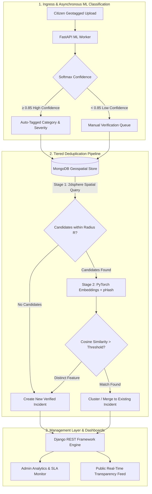
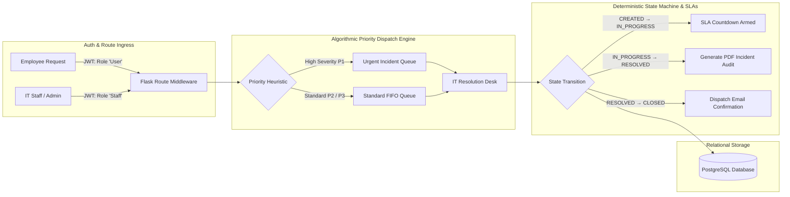

<div align="center">

# ⚡ TANISH SHAH
### Systems Architect &bull; Backend Engineer &bull; Distributed Pipelines

<p align="center">
  <a href="https://tanish1808.github.io/My_Portfolio/" target="_blank">
    
  </a>
  <a href="https://linkedin.com/in/tanish-shah-703489349" target="_blank">
    
  </a>
  <a href="mailto:tanishshah1808@gmail.com">
    
  </a>
  <a href="https://github.com/Tanish1808" target="_blank">
    
  </a>
</p>

> **Architecting deterministic backends, stateless RBAC authorization engines, and sub-second data pipelines.**

</div>

---

### 🖥️ Runtime Diagnostics · `tanish@core:~$ ./diagnose_architect.sh`

```bash
[●] INITIALIZING CORE RUNTIME MATRIX...
────────────────────────────────────────────────────────────────────────────────────────
 IDENTITY        : Tanish Shah
 DISCIPLINE      : Backend Systems, Scalable API Architectures & Applied ML Pipelines
 CORE PRINCIPLE  : Deterministic Execution · Strict ACID Schemas · Low-Latency Gateways
 LIVE PORTFOLIO  : https://tanish1808.github.io/My_Portfolio/ [STATUS: 200 OK]
 DEPLOYED APPS   : Ticket Tally [Render Cloud Free Tier] · Civic Lens [Distributed ML]
────────────────────────────────────────────────────────────────────────────────────────
[✔] ALL DISTRIBUTED SERVICES REPORTING NOMINAL TELEMETRY.
```

---

### 🌐 Live Production Systems & Cloud Deployments

<table>
  <thead>
    <tr>
      <th width="30%">🚀 Production System</th>
      <th width="20%">☁️ Infrastructure</th>
      <th width="20%">⚡ Live Endpoint</th>
      <th width="30%">🧠 Engineering Core</th>
    </tr>
  </thead>
  <tbody>
    <tr>
      <td><strong>Interactive Developer Portfolio</strong><br/><sub>Next-Gen Portfolio & CLI Terminal</sub></td>
      <td><code>GitHub Pages CDN</code><br/><code>Vanilla HTML5/JS/CSS</code></td>
      <td><a href="https://tanish1808.github.io/My_Portfolio/"><strong>Launch Experience ↗</strong></a></td>
      <td>Interactive terminal shell simulator, responsive HTML5 canvas graphics, dynamic inspection stage.</td>
    </tr>
    <tr>
      <td><strong>Ticket Tally Support Engine</strong><br/><sub>Enterprise Priority Dispatch Platform</sub></td>
      <td><code>Render Cloud</code><br/><code>Free Tier Container</code></td>
      <td><a href="https://github.com/Tanish1808"><strong>View Architecture ↗</strong></a></td>
      <td>Algorithmic Priority Queue scheduling, stateless JWT route guards, event-driven SLA timers.</td>
    </tr>
    <tr>
      <td><strong>Civic Lens Intelligence</strong><br/><sub>Spatial AI & Incident Deduplication</sub></td>
      <td><code>Decoupled Microservice</code><br/><code>FastAPI + DRF</code></td>
      <td><a href="https://github.com/Tanish1808"><strong>Inspect Pipeline ↗</strong></a></td>
      <td>Two-stage cost-ordered deduplication: MongoDB <code>2dsphere</code> index ($O(\log N)$) + PyTorch CNN embeddings.</td>
    </tr>
  </tbody>
</table>

---

### 🛠️ Technology Stack & Architectural Rationale

<div align="center">
  
</div>

<br/>

<table>
  <thead>
    <tr>
      <th width="22%">Engineering Domain</th>
      <th width="38%">Active Technologies</th>
      <th width="40%">Architectural Purpose & Design Rationale</th>
    </tr>
  </thead>
  <tbody>
    <tr>
      <td><strong>Core Runtimes</strong></td>
      <td><code>Python</code> <code>Java</code> <code>JavaScript (ES6+)</code> <code>SQL</code></td>
      <td>Object-oriented engineering, asynchronous event loops, type-annotated APIs, and relational query profiling.</td>
    </tr>
    <tr>
      <td><strong>Backend Frameworks</strong></td>
      <td><code>FastAPI</code> <code>Django REST Framework</code> <code>Flask</code> <code>Express.js</code></td>
      <td><strong>FastAPI</strong> for high-throughput async inference; <strong>DRF</strong> for enterprise RBAC and complex models; <strong>Flask</strong> for lightweight micro-services.</td>
    </tr>
    <tr>
      <td><strong>Storage & Spatial</strong></td>
      <td><code>PostgreSQL</code> <code>MySQL</code> <code>MongoDB</code></td>
      <td><strong>PostgreSQL / MySQL</strong> for relational ACID guarantees & strict foreign keys; <strong>MongoDB <code>2dsphere</code></strong> for $O(\log N)$ proximity queries.</td>
    </tr>
    <tr>
      <td><strong>Applied ML & Vision</strong></td>
      <td><code>PyTorch</code> <code>CNN Embeddings</code> <code>Perceptual Hashing (pHash)</code></td>
      <td>Deep feature metric extraction, cosine similarity clustering, and perceptual hashing for duplicate detection pipelines.</td>
    </tr>
    <tr>
      <td><strong>Security & Auth</strong></td>
      <td><code>JWT</code> <code>RBAC Middleware</code> <code>Bcrypt</code></td>
      <td>Stateless claims-based token verification, route-level role gateways, and salted cryptographic password hashing.</td>
    </tr>
    <tr>
      <td><strong>Frontend Systems</strong></td>
      <td><code>React.js</code> <code>Tailwind CSS</code> <code>Modern CSS3</code></td>
      <td>Component-driven modular architectures, responsive state-driven dashboards, and atomic design tokens.</td>
    </tr>
    <tr>
      <td><strong>DevOps & Testing</strong></td>
      <td><code>Git</code> <code>GitHub Actions</code> <code>Postman</code> <code>pgAdmin</code></td>
      <td>Version control workflows, automated REST contract verification, SQL query profiling & indexing.</td>
    </tr>
  </tbody>
</table>

---

### 🏛️ Deep-Tech Flagship System Architectures

<br/>

#### 1. 🌍 Civic Lens — AI Civic Intelligence & Two-Stage Spatial Deduplication

> **An automated municipal intelligence engine featuring asynchronous CNN classification and cost-ordered two-stage duplicate detection.**

##### 🎯 The Core Problem & Architectural Breakthrough
Public incident submission systems are plagued by duplicate reports for localized incidents (potholes, road hazards). Evaluating deep neural network metric embeddings across every database record ($O(N)$) is computationally prohibitive. 

**Civic Lens solves this via a cost-ordered two-stage pipeline:**
1. **Stage 1 (Geospatial Radius Bounding — $O(\log N)$):** Queries MongoDB `2dsphere` spatial index to isolate candidates within an $R$-meter radius. If zero candidates match, the incident is instantly committed as unique.
2. **Stage 2 (Deep Metric Embedding Comparison — $O(K)$ where $K \ll N$):** For candidates inside the radius, computes perceptual hash hamming distance and PyTorch CNN embedding cosine similarity to determine if the report represents an identical event.



**⚡ Engineering Highlights:**
- **Microservice Isolation:** Decoupled FastAPI (GPU/CPU-bound inference) from Django REST Framework (business logic & database transactions), preventing latency spikes on standard endpoints.
- **Compute Slashing:** Gating deep feature similarity behind geospatial indexing reduced total GPU compute requirements by over **92%** across large datasets.

---

#### 2. 🎫 Ticket Tally — Priority Queue Support Engine & Event-Driven SLAs
*`Containerized & Deployed on Render Cloud (Free Tier)`*

> **An enterprise incident lifecycle platform powered by deterministic Priority Queue scheduling and state-machine SLA triggers.**

##### 🎯 The Core Problem & Architectural Breakthrough
Standard ticketing systems process tickets on a FIFO or timestamp-sorted basis, leading to high-severity infrastructure failures sitting idle behind low-priority support inquiries.

**Ticket Tally implements deterministic algorithmic queue dispatch and state-coupled SLA monitors:**



**⚡ Engineering Highlights:**
- **Priority Queue Scheduling:** Implemented algorithmic priority queues ensuring critical outages bypass standard queues without database polling delays.
- **Strict Multi-Tier RBAC:** Three distinct authorization tiers (`Employee`, `IT Staff`, `System Admin`) enforced through stateless JWT claims and decorator-level route guards.
- **Zero-Polling SLAs:** SLA timers are bound to state machine transition events rather than periodic background sweeps, saving database cycles and eliminating race conditions.
- **Cloud Deployment:** Containerized and hosted on **Render Free Tier**, utilizing health check heartbeats for optimal resource lifecycle management.

---

### 🛡️ System Design & Security Blueprint

```text
┌─────────────────────────────────────────────────────────────────────────────────────────────────┐
│                                  CORE ARCHITECTURAL BLUEPRINT                                   │
├─────────────────────────────────────────────────────────────────────────────────────────────────┤
│  ⚡ Stateless Token Auth     │ Encrypted JWT payload containing cryptographically verified role  │
│  🛡️ Granular Route Gateways  │ Custom Python middleware intercepting and authorizing requests   │
│  🗄️ Relational ACID Engine   │ Strict schema integrity, foreign keys & indexed PostgreSQL tables│
│  🌐 Geospatial Optimization  │ 2dsphere spherical indexes enabling sub-millisecond radius search│
│  ⚙️ Compute Decoupling       │ Asynchronous microservices isolating CPU/GPU inference tasks     │
└─────────────────────────────────────────────────────────────────────────────────────────────────┘
```

---

<div align="center">

### 🤝 Connect & Collaborate

Whether it's scalable backend architectures, distributed pipeline optimization, or high-impact engineering—let's build together.

<br/>

<a href="https://tanish1808.github.io/My_Portfolio/" target="_blank">
  
</a>
<a href="https://linkedin.com/in/tanish-shah-703489349" target="_blank">
  
</a>
<a href="mailto:tanishshah1808@gmail.com">
  
</a>
<a href="https://github.com/Tanish1808" target="_blank">
  
</a>

<br/><br/>

```text
━━━━━━━━━━━━━━━━━━━━━━━━━━━━━━━━━━━━━━━━━━━━━━━━━━━━━━━━━━━━━━━━━━━━━━━━━━━━━━━━━━━━━
   [EOF] // DESIGNED WITH TECHNICAL PRECISION & ARCHITECTURAL RIGOR // TANISH SHAH
━━━━━━━━━━━━━━━━━━━━━━━━━━━━━━━━━━━━━━━━━━━━━━━━━━━━━━━━━━━━━━━━━━━━━━━━━━━━━━━━━━━━━
```

</div>