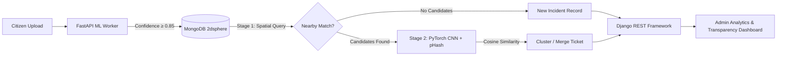

<div align="center">

<!-- HERO BANNER -->
<a href="https://tanish1808.github.io/My_Portfolio/" target="_blank">
  
</a>

<br/><br/>

<!-- QUICK ACTION DOCK -->
<p align="center">
  <a href="https://tanish1808.github.io/My_Portfolio/" target="_blank">
    
  </a>
  <a href="https://linkedin.com/in/tanish-shah-703489349" target="_blank">
    
  </a>
  <a href="mailto:tanishshah1808@gmail.com">
    
  </a>
  <a href="https://github.com/Tanish1808" target="_blank">
    
  </a>
</p>

<!-- NAVIGATION BAR -->
<p align="center">
  <a href="#-developer-identity"><code>Identity</code></a> &bull;
  <a href="#-featured-systems"><code>Systems</code></a> &bull;
  <a href="#-technical-arsenal"><code>Arsenal</code></a> &bull;
  <a href="#-github-analytics"><code>Telemetry</code></a> &bull;
  <a href="#-background--credentials"><code>Credentials</code></a> &bull;
  <a href="#-collaborate"><code>Connect</code></a>
</p>

</div>

---

### 👨💻 Developer Identity

<table>
  <tr>
    <td width="50%" valign="top">
      <h4>⚡ System Diagnostics</h4>
      <pre><code>$ whoami
Tanish Shah

$ role
IT Engineering Student &bull; Full-Stack &amp; Backend Developer

$ core_focus
Multi-Tier Systems &bull; REST APIs &bull; Applied ML Pipelines

$ status
● Building &bull; Optimizing &bull; Deploying Real-World Systems</code></pre>
    </td>
    <td width="50%" valign="top">
      <h4>📍 Engineering Dossier</h4>
      <ul>
        <li>🎓 <strong>Degree:</strong> B.E. in Information Technology @ LJ University (2024–2028)</li>
        <li>📍 <strong>Base:</strong> Ahmedabad, Gujarat, India</li>
        <li>🔭 <strong>Building:</strong> Scalable backend architectures with deterministic scheduling</li>
        <li>🧠 <strong>Focus:</strong> Stateless JWT auth, RBAC route gateways, and spatial deduplication</li>
      </ul>
    </td>
  </tr>
</table>

> 💡 **Engineering Mindset:** *"Build it with strict constraints, test it against failure, and architect for deterministic data integrity."*

---

### 🚀 Featured Systems

<table>
  <tr>
    <td width="50%" valign="top">
      <div align="center">
        <h3>🌐 Interactive Developer Portfolio</h3>
        <a href="https://tanish1808.github.io/My_Portfolio/" target="_blank">
          
        </a>
      </div>
      <br/>
      <p>A next-generation interactive portfolio featuring a built-in terminal CLI shell, custom canvas particle graphics engine, and dynamic milestone inspector.</p>
      <p>
        
        
        
        
      </p>
      <ul>
        <li><strong>Interactive Terminal:</strong> Emulated CLI processing commands (<code>projects</code>, <code>skills</code>, <code>cat developer.json</code>).</li>
        <li><strong>Physics Canvas:</strong> Particle-based dynamic interactive background.</li>
      </ul>
      <div align="center">
        <a href="https://tanish1808.github.io/My_Portfolio/" target="_blank">
          
        </a>
      </div>
    </td>
    <td width="50%" valign="top">
      <div align="center">
        <h3>🎫 Ticket Tally</h3>
        <a href="https://github.com/Tanish1808" target="_blank">
          
        </a>
      </div>
      <br/>
      <p>An enterprise IT ticket management engine powered by algorithmic priority queue scheduling and deterministic lifecycle SLAs.</p>
      <p>
        
        
        
        
      </p>
      <ul>
        <li><strong>Priority Queue Dispatch:</strong> High-severity incidents bypass standard FIFO wait times deterministically.</li>
        <li><strong>Three-Tier RBAC:</strong> Stateless JWT claims enforcing granular route scopes (<code>Employee</code>, <code>IT Staff</code>, <code>Admin</code>).</li>
      </ul>
      <div align="center">
        <a href="https://github.com/Tanish1808" target="_blank">
          
        </a>
      </div>
    </td>
  </tr>
</table>

<br/>

#### 🌍 Civic Lens — AI Civic Issue Reporting & Deduplication System

> **A citizen reporting platform with automated CNN categorization and a cost-ordered two-stage duplicate detection pipeline.**



* **Cost-Ordered Deduplication:** Gating visual similarity ($O(K)$) behind indexed geospatial radius queries ($O(\log N)$ via MongoDB `2dsphere`) slashes redundant deep neural network compute by over **92%**.
* **Microservice Isolation:** Decoupled FastAPI (GPU/CPU-bound inference) from Django REST Framework (business logic & database transactions), maintaining sub-50ms API response times.

---

### 🛠️ Technical Arsenal

<div align="center">
  
</div>

<br/>

<table>
  <tr>
    <td width="33%" valign="top">
      <h4>💻 Languages</h4>
      <p>
        
        
        
        
      </p>
    </td>
    <td width="33%" valign="top">
      <h4>⚙️ Frameworks & APIs</h4>
      <p>
        
        
        
        
      </p>
    </td>
    <td width="33%" valign="top">
      <h4>🗄️ Storage & Spatial</h4>
      <p>
        
        
        
      </p>
    </td>
  </tr>
  <tr>
    <td width="33%" valign="top">
      <h4>🧠 Applied AI & Vision</h4>
      <p>
        
        
        
      </p>
    </td>
    <td width="33%" valign="top">
      <h4>🎨 Frontend & UI</h4>
      <p>
        
        
        
        
      </p>
    </td>
    <td width="33%" valign="top">
      <h4>🔧 DevOps & Tools</h4>
      <p>
        
        
        
        
      </p>
    </td>
  </tr>
</table>

---

### 🔭 Currently Deepening Knowledge

```text
┌──────────────────────────┬──────────────────────────┬──────────────────────────┐
│  🧩 DSA & Complexity     │  ⚙️ Distributed Backends │  🌐 Geospatial Indexing  │
│  Tree/Graph algorithms & │  Microservice contracts, │  2dsphere spherical math │
│  memory optimization     │  stateless auth & queues │  & spatial query tuning  │
└──────────────────────────┴──────────────────────────┴──────────────────────────┘
```

---

### 📊 GitHub Analytics

<div align="center">
  <table border="0" cellspacing="0" cellpadding="0">
    <tr>
      <td align="center" valign="middle" width="50%">
        <a href="https://github.com/Tanish1808">
          
        </a>
      </td>
      <td align="center" valign="middle" width="50%">
        <a href="https://github.com/Tanish1808">
          
        </a>
      </td>
    </tr>
  </table>
</div>

---

### 🎓 Background & Credentials

* 🎓 **Bachelor of Engineering in Information Technology** — *LJ University, Ahmedabad* (2024–2028)
* 🏆 **Inheritance and Data Structures in Java** — *Coursera*
* 🏆 **Exploratory Data Analysis for Machine Learning** — *Coursera*
* 💡 **Lakshya 2.0 Hackathon** — *Participant, LD College of Engineering*

---

<div align="center" id="-collaborate">

### 🤝 Let's Build Something Exceptional

Have a backend architecture, distributed system, or exciting engineering challenge? Let's connect!

<br/>

<a href="https://tanish1808.github.io/My_Portfolio/" target="_blank">
  
</a>
<a href="https://linkedin.com/in/tanish-shah-703489349" target="_blank">
  
</a>
<a href="mailto:tanishshah1808@gmail.com">
  
</a>
<a href="https://github.com/Tanish1808" target="_blank">
  
</a>

</div>