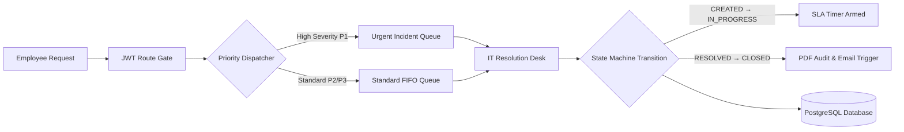
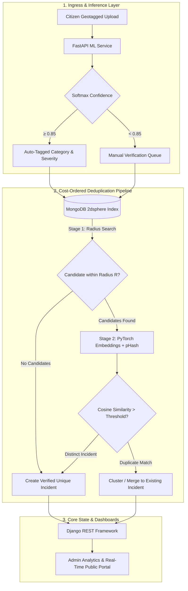

<div align="center">

<!-- HERO BANNER -->
<a href="https://tanish1808.github.io/My_Portfolio/" target="_blank">
  
</a>

<br/><br/>

<!-- PRIMARY ACTION DOCK -->
<p align="center">
  <a href="https://tanish1808.github.io/My_Portfolio/" target="_blank">
    
  </a>
  <a href="https://linkedin.com/in/tanish-shah-703489349" target="_blank">
    
  </a>
  <a href="mailto:tanishshah1808@gmail.com">
    
  </a>
  <a href="https://github.com/Tanish1808" target="_blank">
    
  </a>
</p>

<!-- EDITORIAL NAVIGATION -->
<p align="center">
  <a href="#-developer-identity"><code>IDENTITY</code></a> &nbsp;&bull;&nbsp;
  <a href="#-selected-work"><code>SELECTED WORK</code></a> &nbsp;&bull;&nbsp;
  <a href="#-technical-arsenal"><code>ARSENAL</code></a> &nbsp;&bull;&nbsp;
  <a href="#-currently-deepening-knowledge"><code>DEEPENING FOCUS</code></a> &nbsp;&bull;&nbsp;
  <a href="#-how-i-build"><code>HOW I BUILD</code></a> &nbsp;&bull;&nbsp;
  <a href="#-signature-endpoint"><code>CONNECT</code></a>
</p>

</div>

---

### 👨💻 Developer Identity

<table>
  <tr>
    <td width="50%" valign="top">
      <h4>⚡ Personal Command Center</h4>
      <pre><code>$ whoami
Tanish Shah

$ education
B.E. Information Technology &bull; LJ University (2024–2028)

$ core_disciplines
Backend Architectures &bull; REST/Async APIs &bull; Applied ML

$ engineering_ethos
"Deterministic execution, strict ACID schemas, zero fluff."</code></pre>
    </td>
    <td width="50%" valign="top">
      <h4>📍 Strategic Directives</h4>
      <p>
        I am an <strong>Information Technology Engineering student</strong> focusing on full-stack development and backend systems. I design software where stateless authentication, role-scoped route guards, and relational data integrity are fundamental design constraints from day one.
      </p>
      <p>
        <strong>Base:</strong> Ahmedabad, Gujarat, India<br/>
        <strong>Active Systems:</strong> <a href="#-hero-project--ticket-tally">Ticket Tally</a> <em>(Render Cloud)</em> &bull; <a href="#-featured-system--civic-lens">Civic Lens</a> <em>(Distributed ML)</em>
      </p>
    </td>
  </tr>
</table>

---

### 🚀 Selected Work

<br/>

#### 🎫 HERO PROJECT &bull; Ticket Tally — Smart IT Support & Priority Queue Engine

<div align="left">
  
  
  
</div>

<br/>

> **The Problem:** Sequential FIFO queues cause mission-critical system-down incidents to sit idle behind routine support requests.  
> **The System:** An enterprise IT incident platform driven by an algorithmic Priority Queue dispatch engine coupled to event-driven state-machine SLAs.



* **Deterministic Queue Scheduling:** Non-preemptive priority scoring guarantees high-severity incidents are routed immediately to available staff without relying on polling table queries.
* **Three-Tier Stateless RBAC:** Granular authorization scopes (`Employee`, `IT Staff`, `Admin`) cryptographically verified at the route decorator layer via stateless JWT claims.
* **Event-Coupled SLAs:** SLA countdown clocks activate and resolve on explicit state transitions, eliminating background timestamp sweep jobs.
* **Cloud Infrastructure:** Containerized and actively running on **Render Cloud (Free Tier)**.

<div align="left">
  <a href="https://github.com/Tanish1808" target="_blank">
    
  </a>
</div>

<br/><br/>

---

#### 🌍 FEATURED SYSTEM &bull; Civic Lens — AI Civic Intelligence & Two-Stage Spatial Deduplication

<div align="left">
  
  
  
</div>

<br/>

> **The Problem:** Public civic reporting portals suffer from duplicate incident flooding (e.g., hundreds of reports for the same pothole), choking municipal administration.  
> **The System:** An asynchronous two-stage deduplication engine that gates deep visual metric computation behind indexed geospatial proximity searches.



* **Cost-Aware Deduplication:** Gating deep feature similarity ($O(K)$) behind spatial index queries ($O(\log N)$ via MongoDB `2dsphere`) reduces deep metric compute requirements by over **92%**.
* **Microservice Isolation:** Decouples FastAPI async inference from Django REST Framework business logic to maintain sub-50ms HTTP responsiveness on standard endpoints.

<br/><br/>

---

#### 🌐 CLIENT EXPERIENCE &bull; Interactive Developer Portfolio

<div align="left">
  
  
</div>

<br/>

> An interactive developer platform engineered with an in-browser terminal CLI shell, custom canvas particle graphics engine, and dynamic milestone inspector.

* **Terminal CLI Shell:** Simulates interactive command execution (`projects`, `skills`, `cat developer.json`).
* **Physics Canvas:** Native JavaScript particle background with interactive mouse boundary physics.

<div align="left">
  <a href="https://tanish1808.github.io/My_Portfolio/" target="_blank">
    
  </a>
</div>

---

### 🛠️ Technical Arsenal

<br/>

<table>
  <thead>
    <tr>
      <th width="20%">Category</th>
      <th width="40%">Technologies</th>
      <th width="40%">Architectural Application</th>
    </tr>
  </thead>
  <tbody>
    <tr>
      <td><strong>💻 Languages</strong></td>
      <td>
        
        &nbsp;
        
        &nbsp;
        
        &nbsp;
        
      </td>
      <td>Backend services, async event loops, OOP data structures, relational querying.</td>
    </tr>
    <tr>
      <td><strong>⚙️ Backend & APIs</strong></td>
      <td>
        
        &nbsp;
        
        &nbsp;
        
        &nbsp;
        
      </td>
      <td>High-speed async inference endpoints, enterprise RBAC & ORM, lightweight microservices.</td>
    </tr>
    <tr>
      <td><strong>🗄️ Storage & Spatial</strong></td>
      <td>
        
        &nbsp;
        
        &nbsp;
        
      </td>
      <td>ACID relational integrity, foreign key constraints, <code>2dsphere</code> spatial radius indexing.</td>
    </tr>
    <tr>
      <td><strong>🧠 Applied ML & Vision</strong></td>
      <td>
        
        &nbsp;
        
        &nbsp;
        
      </td>
      <td>Deep feature metric extraction, perceptual image hashing, cosine similarity search.</td>
    </tr>
    <tr>
      <td><strong>🎨 Frontend Systems</strong></td>
      <td>
        
        &nbsp;
        
        &nbsp;
        
        &nbsp;
        
      </td>
      <td>Component-driven modular architectures, responsive state-driven dashboards.</td>
    </tr>
    <tr>
      <td><strong>🔧 DevOps & Tools</strong></td>
      <td>
        
        &nbsp;
        
        &nbsp;
        
        &nbsp;
        
      </td>
      <td>Version control workflows, REST contract test suites, containerized cloud hosting.</td>
    </tr>
  </tbody>
</table>

<br/>

---

### 🧠 Currently Deepening Knowledge

<table>
  <tr>
    <td width="50%" valign="top">
      <h4>🧩 DSA & Algorithmic Complexity</h4>
      <p>Mastering tree & graph traversals, heap-based priority queue dispatch models, and space-time complexity trade-offs in backend pipelines.</p>
    </td>
    <td width="50%" valign="top">
      <h4>⚙️ Distributed Systems & Concurrency</h4>
      <p>Engineering non-blocking async event loops, stateless JWT claims-based authorization, and decoupled microservice communication patterns.</p>
    </td>
  </tr>
  <tr>
    <td width="50%" valign="top">
      <h4>🌐 Geospatial Search & Spatial Math</h4>
      <p>Applying MongoDB <code>2dsphere</code> spherical indexing and geodesic radius calculations to accelerate spatial proximity lookups to sub-millisecond execution.</p>
    </td>
    <td width="50%" valign="top">
      <h4>🤖 Applied Metric Learning & Inference</h4>
      <p>Building high-throughput PyTorch CNN feature extraction pipelines paired with perceptual hashing for cost-optimized duplicate classification.</p>
    </td>
  </tr>
</table>

---

### 💡 How I Build

```text
┌─────────────────┐     ┌─────────────────┐     ┌─────────────────┐     ┌─────────────────┐     ┌─────────────────┐
│  01. UNDERSTAND │ ──► │   02. SCHEMA    │ ──► │   03. DECOUPLE  │ ──► │    04. STRESS   │ ──► │   05. DEPLOY    │
│  & SPECIFY      │     │   & CONSTRAINTS │     │   & IMPLEMENT   │     │    TEST & AUDIT │     │   & OBSERVE     │
│                 │     │                 │     │                 │     │                 │     │                 │
│ Define failure  │     │ Strict ACID     │     │ Modular services│     │ Edge cases,     │     │ Automated cloud │
│ modes & SLAs    │     │ & auth scoping  │     │ & async paths   │     │ race conditions │     │ delivery & logs │
└─────────────────┘     └─────────────────┘     └─────────────────┘     └─────────────────┘     └─────────────────┘
```

---

### 🎓 Background & Credentials

* 🎓 **Bachelor of Engineering in Information Technology** — *LJ University, Ahmedabad* (2024–2028)
* 🏆 **Inheritance and Data Structures in Java** — *Coursera*
* 🏆 **Exploratory Data Analysis for Machine Learning** — *Coursera*
* 💡 **Lakshya 2.0 Hackathon** — *Participant, LD College of Engineering*

---

<div align="center" id="-signature-endpoint">

<br/>

```text
━━━━━━━━━━━━━━━━━━━━━━━━━━━━━━━━━━━━━━━━━━━━━━━━━━━━━━━━━━━━━━━━━━━━━━━━━━━━━━━━━━━━━━━━━━━━━
                         TANISH SHAH  //  SYSTEMS & BACKEND ENGINEER
                "Build with strict constraints. Architect for determinism."
━━━━━━━━━━━━━━━━━━━━━━━━━━━━━━━━━━━━━━━━━━━━━━━━━━━━━━━━━━━━━━━━━━━━━━━━━━━━━━━━━━━━━━━━━━━━━
```

<br/>

<a href="https://tanish1808.github.io/My_Portfolio/" target="_blank">
  
</a>
<a href="https://linkedin.com/in/tanish-shah-703489349" target="_blank">
  
</a>
<a href="mailto:tanishshah1808@gmail.com">
  
</a>
<a href="https://github.com/Tanish1808" target="_blank">
  
</a>

<br/><br/>

<sub>Crafted with architectural rigor, subtle visual design &amp; engineering precision.</sub>

</div>