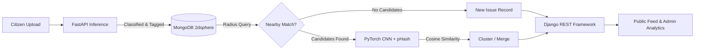
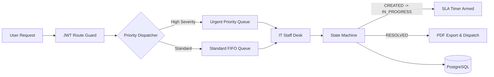

# Tanish Shah

```
Location      Ahmedabad, India
Focus         Backend Engineering · Distributed Systems · Applied ML
Portfolio     https://tanish1808.github.io/My_Portfolio/
Contact       tanishshah1808@gmail.com · linkedin.com/in/tanish-shah-703489349
```

I build multi-tier systems where authentication, role-based authorization, and data integrity are structural requirements rather than afterthoughts. Most of my work sits at the intersection of backend service design, relational schema modeling, and cost-aware machine learning pipelines.

---

### Selected Systems

#### 01 / Civic Lens
*AI-assisted civic infrastructure reporting with cost-tiered spatial deduplication*

Public reporting platforms frequently fail when duplicate incident submissions overwhelm administrative review queues. Civic Lens solves this by decoupling high-throughput ingest from expensive computer vision inference.



* **Tiered Cost Optimization:** Instead of computing high-dimensional metric embeddings over all records ($O(N)$), the system gates visual similarity behind indexed spherical queries ($O(\log N)$ via MongoDB `2dsphere`). Deep feature extraction only runs on localized candidates.
* **Service Decoupling:** FastAPI isolates GPU/CPU-bound inference routines from Django REST Framework's relational business logic, keeping API latency bounded under burst ingestion.
* **Confidence Gating:** Low-confidence classifications are directed into an explicit verification queue rather than polluting downstream administrative metrics.

`Django REST Framework` `FastAPI` `PyTorch` `MongoDB` `React`

---

#### 02 / Ticket Tally
*Role-scoped IT incident dispatch engine with state-bound SLA scheduling*

Standard ticketing software often models queues as sequential FIFO lists or database timestamp sorts, causing critical infrastructure outages to wait behind trivial requests.



* **Deterministic Dispatch:** Replaces ad-hoc sorting queries with priority queue dispatching, guaranteeing that high-severity incidents are routed immediately regardless of ingestion volume.
* **Granular Scope Enforcement:** Implements three explicit role boundaries (`Employee`, `IT Staff`, `Admin`) verified at the route decorator layer via stateless JWT claims.
* **Zero-Polling SLAs:** SLA timers bind directly to state transition events (`CREATED` $\rightarrow$ `IN_PROGRESS` $\rightarrow$ `RESOLVED`), eliminating polling cron jobs and database race conditions.
* **Deployment:** Hosted on **Render (Cloud Free Tier)** with continuous containerized builds.

`Flask` `PostgreSQL` `JavaScript` `JWT` `Render`

---

### Technical Focus

| Domain | Primary Tools | Architectural Application |
| :--- | :--- | :--- |
| **Languages** | Python, Java, JavaScript (ES6+), SQL | Backend services, async event loops, OOP design, relational DDL |
| **Backend & APIs** | FastAPI, Django REST Framework, Flask | Async inference gateways, enterprise RBAC, lightweight microservices |
| **Data & Storage** | PostgreSQL, MySQL, MongoDB | Relational ACID constraints, query indexing, `2dsphere` spatial search |
| **Machine Learning** | PyTorch, Perceptual Hashing (pHash) | Deep CNN feature extraction, cosine embedding metric evaluation |
| **Security & Auth** | JWT, RBAC Middleware, Bcrypt | Stateless token verification, route-level authorization guards |
| **Tooling & Ops** | Git, GitHub, Postman, pgAdmin, Render | Version workflows, contract testing, SQL profiling, cloud hosting |

---

### Live Systems & Codebases

* [**Interactive Developer Portfolio**](https://tanish1808.github.io/My_Portfolio/) — Custom terminal CLI shell simulator, canvas graphics engine, and responsive UI architecture.
* [**Ticket Tally**](https://github.com/Tanish1808) — Enterprise IT support system with algorithmic priority dispatch (Deployed on Render).
* [**Civic Lens**](https://github.com/Tanish1808) — Two-stage spatial and computer vision deduplication engine.

---

### Background

* **Education:** B.E. in Information Technology, LJ University (2024–2028)
* **Certifications:** *Inheritance and Data Structures in Java* (Coursera) · *Exploratory Data Analysis for ML* (Coursera)
* **Hackathons:** Lakshya 2.0 Hackathon Participant (LD College of Engineering)

---

<p align="center">
  <a href="https://tanish1808.github.io/My_Portfolio/"><strong>Explore Portfolio</strong></a> &nbsp;&bull;&nbsp;
  <a href="https://linkedin.com/in/tanish-shah-703489349"><strong>LinkedIn</strong></a> &nbsp;&bull;&nbsp;
  <a href="mailto:tanishshah1808@gmail.com"><strong>tanishshah1808@gmail.com</strong></a> &nbsp;&bull;&nbsp;
  <a href="https://github.com/Tanish1808"><strong>GitHub</strong></a>
</p>