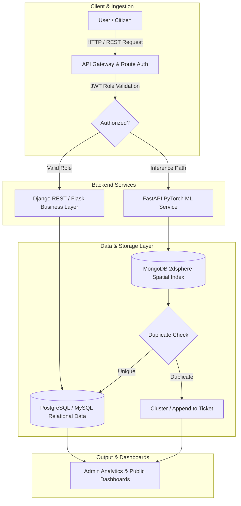

  

   

  
  
  
  

    

  

    <strong>Building scalable multi-tier architectures, high-performance REST APIs, and applied ML pipelines.</strong>
  

---

### 🚀 Featured Systems & Live Deployments

<table>
  <tr>
    <td width="50%" valign="top">
      <h3 align="center">🌐 Interactive Developer Portfolio</h3>
      

        
      

      
A next-generation interactive portfolio featuring a built-in terminal CLI emulator, canvas engine, and dynamic milestone inspector.

      

        
        
        
      

      <ul>
        <li>Interactive shell emulator with real-time command processing</li>
        <li>Responsive canvas particle rendering engine</li>
        <li>Modular, high-performance component architecture</li>
      </ul>
      

        <a href="https://tanish1808.github.io/My_Portfolio/"><strong>🔗 Launch Portfolio →</strong></a>
      

    </td>
    <td width="50%" valign="top">
      <h3 align="center">🎫 Ticket Tally</h3>
      

        
      

      
An enterprise IT support and ticket dispatch engine driven by algorithmic priority queue scheduling and role-based access control.

      

        
        
        
      

      <ul>
        <li>Priority Queue heuristics ensuring critical incidents bypass FIFO queues</li>
        <li>Three-tier RBAC (Employee, IT Staff, Admin) enforced via JWT</li>
        <li>State-coupled SLA tracking with automated email & PDF reports</li>
      </ul>
      

        <a href="https://github.com/Tanish1808"><strong>🔗 View Repository →</strong></a>
      

    </td>
  </tr>
  <tr>
    <td colspan="2" valign="top">
      <h3 align="center">🌍 Civic Lens — AI Civic Issue Reporting & Deduplication Platform</h3>
      

        
        
        
        
        
      

      

        A citizen reporting platform with automated CNN categorization and a two-stage cost-ordered deduplication engine that stops identical incident flooding.
      

      <ul>
        <li><strong>Stage 1 (Spatial Filter):</strong> Queries MongoDB <code>2dsphere</code> index for nearby incidents within radius $R$ ($O(\log N)$).</li>
        <li><strong>Stage 2 (Vision Filter):</strong> Evaluates PyTorch CNN embeddings and perceptual hashing (pHash) cosine similarity on candidate matches.</li>
        <li><strong>Inference Isolation:</strong> Decouples FastAPI async ML inference from Django REST Framework business logic to maintain sub-50ms API response times.</li>
      </ul>
    </td>
  </tr>
</table>

---

### 🛠️ Technical Stack & Skills

  

 

<table>
  <tr>
    <td width="33%" valign="top">
      <h4>💻 Languages</h4>
      <ul>
        <li><strong>Python</strong> — Backend & ML Pipelines</li>
        <li><strong>Java</strong> — OOP & Data Structures</li>
        <li><strong>JavaScript (ES6+)</strong> — Web Logic</li>
        <li><strong>SQL</strong> — Relational Queries & DDL</li>
      </ul>
    </td>
    <td width="33%" valign="top">
      <h4>⚙️ Frameworks & Backend</h4>
      <ul>
        <li><strong>FastAPI</strong> — High-Speed Async APIs</li>
        <li><strong>Django / DRF</strong> — Enterprise RBAC & CRUD</li>
        <li><strong>Flask</strong> — Lightweight Microservices</li>
        <li><strong>Node.js / Express</strong> — Event Runtimes</li>
      </ul>
    </td>
    <td width="33%" valign="top">
      <h4>🗄️ Databases & Storage</h4>
      <ul>
        <li><strong>PostgreSQL</strong> — ACID Relational Design</li>
        <li><strong>MySQL</strong> — Schema Indexing & Integrity</li>
        <li><strong>MongoDB</strong> — <code>2dsphere</code> Geospatial Search</li>
      </ul>
    </td>
  </tr>
  <tr>
    <td width="33%" valign="top">
      <h4>🧠 Machine Learning & AI</h4>
      <ul>
        <li><strong>PyTorch</strong> — CNN Feature Embeddings</li>
        <li><strong>Perceptual Hashing (pHash)</strong> — Visual Dedup</li>
        <li><strong>Scikit-Learn</strong> — Statistical Modeling</li>
      </ul>
    </td>
    <td width="33%" valign="top">
      <h4>🎨 Frontend & Design</h4>
      <ul>
        <li><strong>React.js</strong> — Component Lifecycle & State</li>
        <li><strong>Tailwind CSS</strong> — Atomic Utility Styling</li>
        <li><strong>HTML5 / CSS3</strong> — Modern Responsive UI</li>
      </ul>
    </td>
    <td width="33%" valign="top">
      <h4>🔧 DevOps & Tools</h4>
      <ul>
        <li><strong>Git & GitHub</strong> — Version Control & CI/CD</li>
        <li><strong>Postman</strong> — API Contract Testing</li>
        <li><strong>pgAdmin</strong> — SQL Performance Tuning</li>
        <li><strong>Render / Vercel</strong> — Cloud Deployments</li>
      </ul>
    </td>
  </tr>
</table>

---

### 🏛️ System Architecture Flowchart

---

### 🤝 Let's Connect

Have a backend architecture, distributed system, or exciting engineering challenge? Let's discuss!

 

  

